# 🎓 IT Department Management System

Информационная система автоматизации работы кафедры IT университета. Дипломный проект 2026.

[](https://openjdk.org/projects/jdk/23/)
[](https://spring.io/projects/spring-boot)
[](https://react.dev)
[](https://www.typescriptlang.org)
[](https://www.postgresql.org)
[](.)
[](https://iitu.edu.kz)

</div>

---

FacultyDesk автоматизирует трудоёмкий документооборот кафедры компьютерной инженерии: дедлайны, публикации, квалификационные комиссии (ККК) и годовые планы учебной нагрузки. Python-робот пакетно генерирует документы Word из Excel-данных и напрямую загружает их в систему; ИИ-ассистент (Groq Llama 3.3 70B) формирует список приоритетов на день для каждого преподавателя, а также обеспечивает умный поиск и формирование резюме профиля.

---

## Содержание

- [✨ Возможности](#-возможности)
- [🖼️ Скриншоты](#️-скриншоты)
- [🛠️ Технологический стек](#️-технологический-стек)
- [🏗️ Архитектура](#️-архитектура)
- [🚀 Начало работы](#-начало-работы)
- [📡 Обзор API](#-обзор-api)
- [📂 Структура проекта](#-структура-проекта)
- [👥 Авторы](#-авторы)

---

## ✨ Возможности

**Аутентификация и безопасность**
- Вход по JWT с разделением ролей: `ADMIN`, `TEACHER`, `ROBOT`
- Самостоятельная смена пароля и сброс пароля по e-mail
- Восстановление пароля через SMTP

**Дашборд и дедлайны**
- Персонализированные дашборды (вид преподавателя и вид администратора)
- Администратор создаёт дедлайны кафедры с указанием целевых ролей и триггерами уведомлений
- Преподаватели видят предстоящие дедлайны с цветовой маркировкой по срочности

**ИИ: приоритеты на сегодня**
- Groq Llama 3.3 70B анализирует открытые дедлайны преподавателя, недавнюю активность и полноту профиля, формируя приоритизированный «список дел на день»
- Плавающий ИИ-чат с историей переписки и специализированным режимом тьютора ККК

**ИИ-поиск шаблонов**
- Поиск по свободному тексту: ИИ подбирает подходящие шаблоны документов
- Предпросмотр шаблона (docx → HTML через mammoth) и прямое скачивание

**Python-робот для отчётов**
- Читает файлы нагрузки `.xlsx`, генерирует отчёты `.docx` по шаблону docxtpl и загружает их на бэкенд через REST
- Каждый запуск фиксируется (`RobotRun`) — администраторы видят статус, количество обработанных файлов и ошибок, а также лог каждого запуска
- Учётные данные робота управляются через выделенный сервисный аккаунт `ROLE_ROBOT`

**Публикации и академические записи**
- Полный CRUD для публикаций с прикреплением файлов, рабочий процесс «подать / подтвердить / отклонить»
- ИИ-извлечение метаданных публикации из произвольного текста
- Учёт курсов повышения квалификации, наград, патентов и трудового стажа

**Аналитика**
- Аналитический дашборд на Recharts: статистика публикаций по годам, разбивка по категориям, процент выполнения дедлайнов
- Виджет закреплённых элементов с перетаскиванием (dnd-kit)

**Многоязычный интерфейс**
- i18next с переводами на русский и английский языки; переключатель языка в навигационной панели

---

## 🖼️ Скриншоты

<table>
  <tr>
    <td>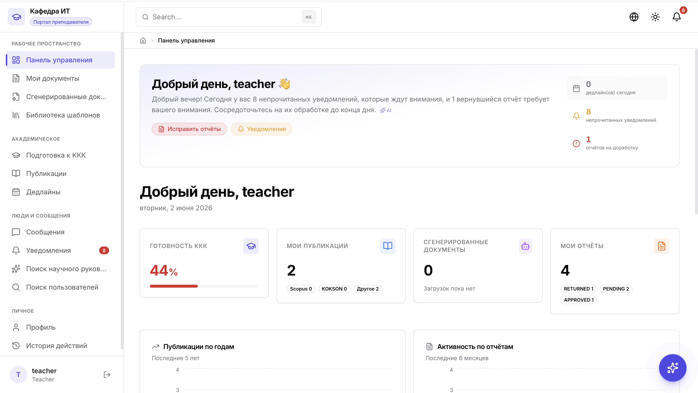<br/><sub>Дашборд преподавателя</sub></td>
    <td>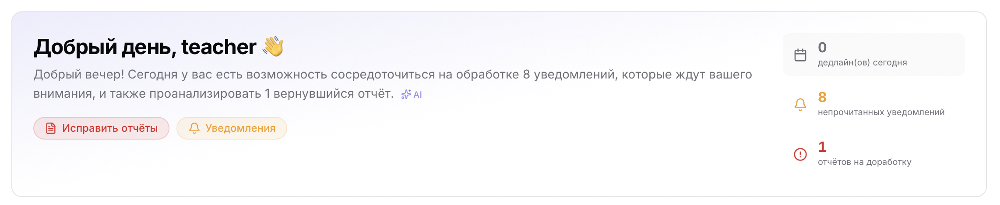<br/><sub>ИИ: приоритеты на сегодня</sub></td>
  </tr>
  <tr>
    <td>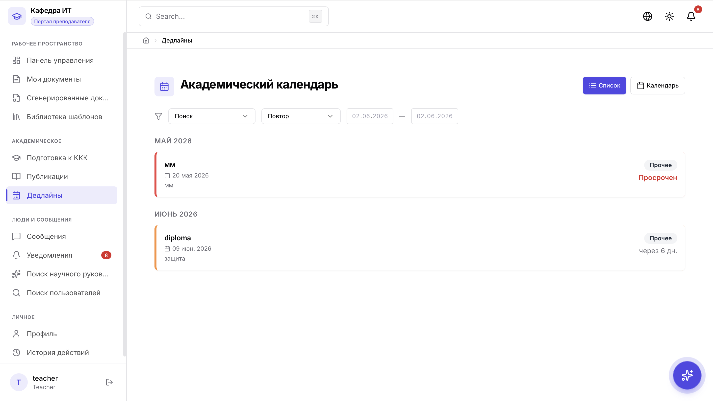<br/><sub>Дедлайны</sub></td>
    <td>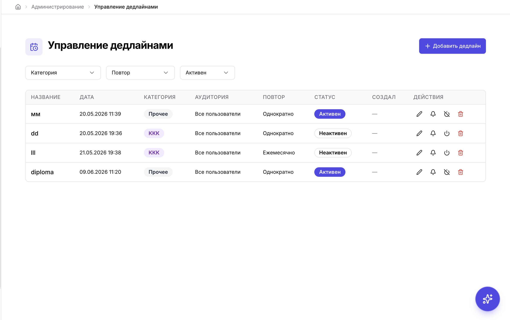<br/><sub>Администратор — управление дедлайнами</sub></td>
  </tr>
  <tr>
    <td>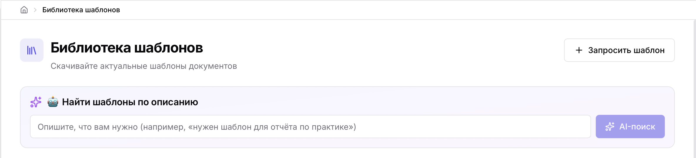<br/><sub>ИИ-поиск шаблонов</sub></td>
    <td>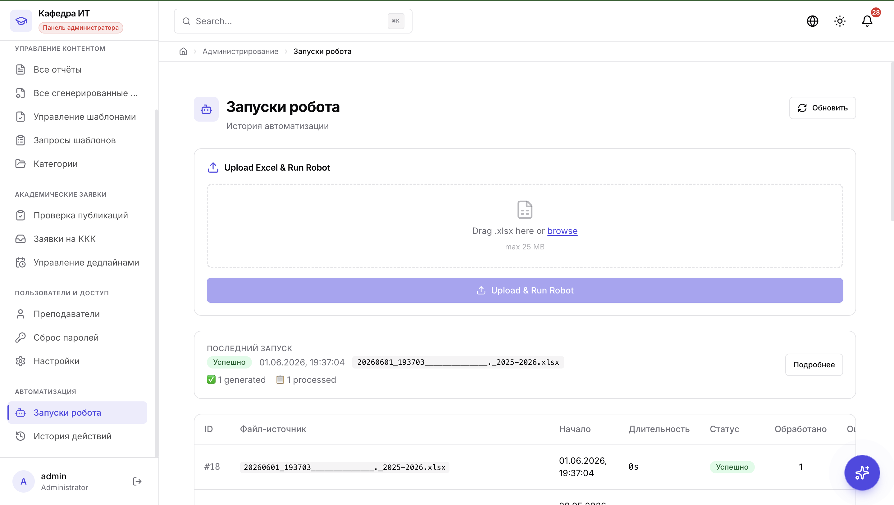<br/><sub>История запусков робота</sub></td>
  </tr>
  <tr>
    <td>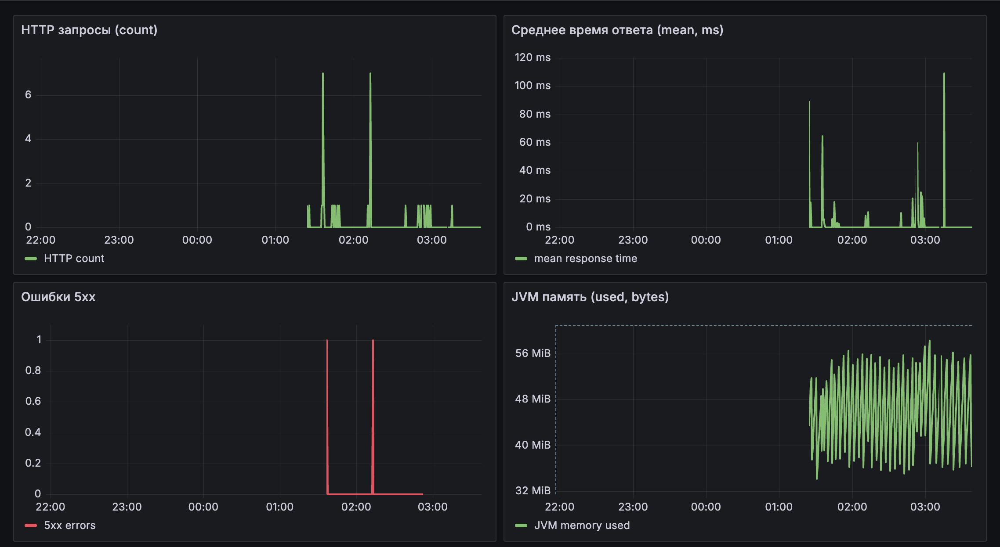<br/><sub>Аналитика</sub></td>
    <td>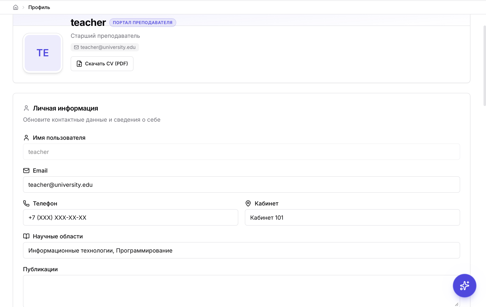<br/><sub>Профиль преподавателя</sub></td>
  </tr>
  <tr>
    <td>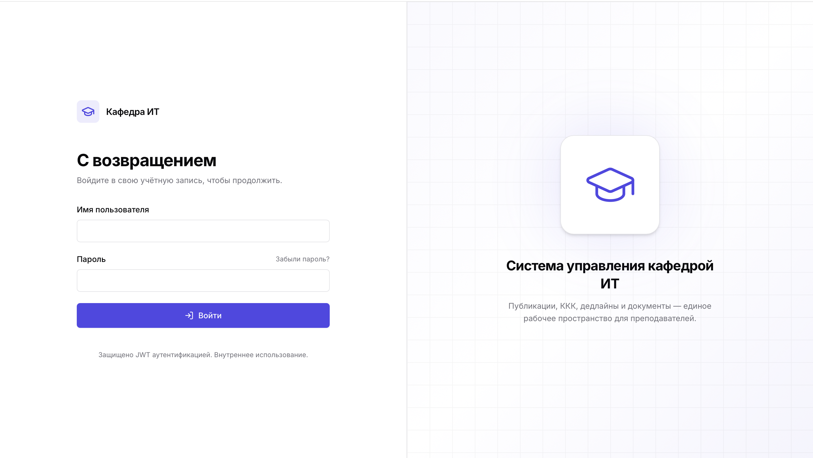<br/><sub>Страница входа</sub></td>
    <td>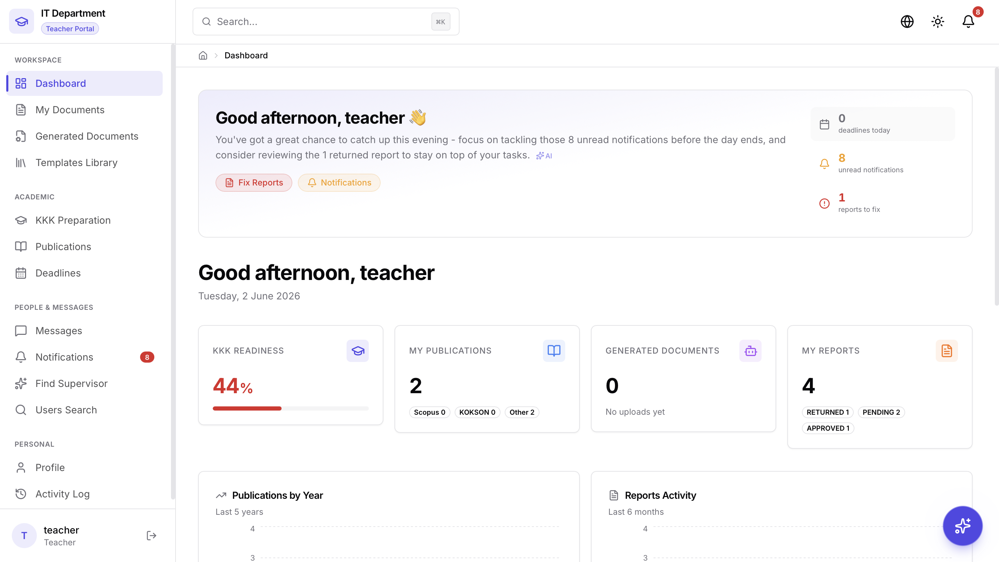<br/><sub>Переключение языка (RU/EN)</sub></td>
  </tr>
</table>

---

## 🛠️ Технологический стек

### Бэкенд

| Технология | Версия | Назначение |
|---|---|---|
| Java | 23 | Среда выполнения |
| Spring Boot | 3.5.6 | Фреймворк |
| Spring Security + JJWT | 0.12.3 | Аутентификация и JWT |
| Spring Data JPA / Hibernate | (Boot-managed) | ORM |
| PostgreSQL | 17 | Основная база данных |
| iText 7 | 8.0.5 | Генерация PDF |
| Apache PDFBox | 3.0.3 | Обработка PDF |
| ZXing | 3.5.3 | Генерация QR-кодов |
| Caffeine Cache | (Boot-managed) | Кэширование в процессе |
| Micrometer + Elastic | (Boot-managed) | Экспорт метрик |
| Logstash Logback Encoder | 7.4 | Структурированное JSON-логирование |
| Lombok | 1.18.40 | Устранение шаблонного кода |
| spring-dotenv | 4.0.0 | Поддержка файлов `.env` |

### Фронтенд

| Технология | Версия | Назначение |
|---|---|---|
| React | 19.2 | UI-библиотека |
| TypeScript | 4.9.5 | Статическая типизация |
| Tailwind CSS | 3.4.19 | Utility-first стилизация |
| shadcn/ui (Radix UI) | latest | Доступные примитивы компонентов |
| TanStack React Query | 5.90 | Серверное состояние и кэширование |
| Axios | 1.13 | HTTP-клиент |
| React Router DOM | 7.10 | Клиентская маршрутизация |
| React Hook Form + Zod | 7.68 / 4.1 | Формы и валидация |
| Recharts | 3.5 | Графики и аналитика |
| Framer Motion | 12.23 | Анимации |
| i18next | 25.7 | Интернационализация |
| dnd-kit | 6.3 / 10.0 | Drag-and-drop |
| mammoth | 1.12 | Предпросмотр docx → HTML |
| react-big-calendar | 1.19 | Календарь |

### Автоматизация и ИИ

| Технология | Версия | Назначение |
|---|---|---|
| Python | 3.10+ | Среда выполнения робота |
| pandas | 2.2.x | Парсинг Excel |
| openpyxl | 3.1.x | Чтение `.xlsx` |
| python-docx | 1.1.x | Работа с документами Word |
| docxtpl | 0.16.x | Шаблоны Word в стиле Jinja2 |
| requests | 2.32.x | Обращения к REST API |
| Groq API (Llama 3.3 70B) | — | ИИ-функции (приоритеты дня, поиск, чат) |

---

## 🏗️ Архитектура

FacultyDesk — классическое трёхзвенное приложение с двумя вспомогательными компонентами:

- **React SPA** (порт 3000 в режиме разработки) взаимодействует с сервером исключительно через REST API с JWT-токеном в заголовке.
- **Spring Boot API** (порт 8080) реализует RBAC, содержит всю бизнес-логику и сохраняет данные через JPA/Hibernate.
- **PostgreSQL** (порт 5432) — единственный источник истины.
- **Groq API** вызывается из сервисного слоя бэкенда для всех ИИ-функций; фронтенд с ним не взаимодействует напрямую.
- **Python Robot** — автономный скрипт, который аутентифицируется на бэкенде как `ROLE_ROBOT`, обрабатывает Excel-файлы и загружает сгенерированные документы Word через REST.

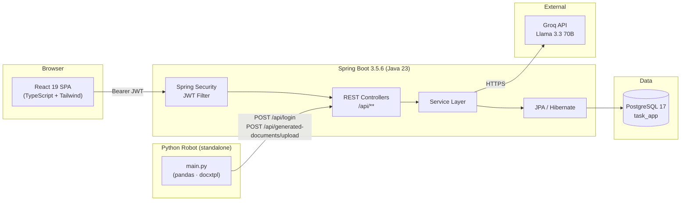

---

## 🚀 Начало работы

### Требования

| Инструмент | Минимальная версия |
|---|---|
| JDK | 23 |
| Maven | 3.9+ |
| Node.js | 20+ |
| PostgreSQL | 14+ |
| Python | 3.10+ |

---

### 1. База данных

```sql
CREATE DATABASE task_app;
CREATE USER postgres WITH PASSWORD 'your_password';
GRANT ALL PRIVILEGES ON DATABASE task_app TO postgres;
```

---

### 2. Бэкенд

```bash
# Clone and enter the project root
git clone <repo-url>
cd fullStackpj

# Copy and edit the environment file (never commit real values)
cp .env.example .env   # or create it manually — see table below

# Build and run
mvn spring-boot:run
# API available at http://localhost:8080
```

**Обязательные переменные окружения**

| Переменная | Описание | Пример / Placeholder |
|---|---|---|
| `GROQ_API_KEY` | Ключ Groq API для ИИ-функций | `gsk_your_key_here` |
| `ROBOT_PASSWORD` | Пароль сервисного аккаунта `robot` | `robot_change_me_2026` |
| `AI_PROVIDER` | Выбор ИИ-бэкенда | `groq` |
| `SPRING_DATASOURCE_URL` | Строка подключения JDBC | `jdbc:postgresql://127.0.0.1:5432/task_app` |
| `SPRING_DATASOURCE_USERNAME` | Пользователь БД | `postgres` |
| `SPRING_DATASOURCE_PASSWORD` | Пароль БД | `your_db_password` |

> Spring Boot читает `.env` через **spring-dotenv** (`me.paulschwarz:spring-dotenv`). Альтернативно можно задать системные переменные окружения или переопределить значения в `application.properties`.

При первом запуске `DataInitializer` создаёт сервисный аккаунт `robot`, используя значение `ROBOT_PASSWORD`.

---

### 3. Фронтенд

```bash
cd frontend
npm install
npm start
# Dev server at http://localhost:3000
```

Для production-сборки:

```bash
npm run build
# Output → frontend/build/  (served by Spring Boot's static handler)
```

---

### 4. Python-робот

> **Примечание для macOS:** используйте `python3` (не `python`). Перед `pip install` всегда активируйте виртуальное окружение. Учётные данные робота в `.env` должны совпадать с настройками бэкенда.

```bash
cd robot
python3 -m venv venv
source venv/bin/activate          # Windows: venv\Scripts\activate
pip install -r requirements.txt
cp .env.example .env
# Edit .env — see table below
```

**Переменные окружения робота** (`robot/.env`)

| Переменная | Описание | Пример |
|---|---|---|
| `BACKEND_URL` | Базовый URL Spring Boot | `http://localhost:8080` |
| `ROBOT_USERNAME` | Логин сервисного аккаунта | `robot` |
| `ROBOT_PASSWORD` | Должен совпадать с `ROBOT_PASSWORD` бэкенда | `robot_change_me_2026` |
| `INPUT_DIR` | Папка для сканирования файлов `.xlsx` | `./input` |
| `OUTPUT_DIR` | Папка для сгенерированных файлов `.docx` | `./output` |
| `TEMPLATE_PATH` | Шаблон Word для docxtpl | `./templates/workload_template.docx` |
| `LOG_LEVEL` | `DEBUG` / `INFO` / `WARNING` | `INFO` |

**Запуск робота:**

```bash
source venv/bin/activate
python3 main.py
# or process a single file:
python3 main.py --input ./input/workload_fall_2025.xlsx
```

Робот входит в систему как `ROLE_ROBOT`, создаёт запись `RobotRun`, обрабатывает все `.xlsx` в `INPUT_DIR`, генерирует `.docx` для каждого преподавателя по шаблону Word, загружает файл на `/api/generated-documents/upload` и перемещает обработанные файлы в `input/processed/`.

**Расписание (cron для Linux/macOS — каждый понедельник в 02:00):**

```cron
0 2 * * 1 cd /path/to/robot && ./venv/bin/python3 main.py >> robot.cron.log 2>&1
```

---

## 📡 Обзор API

Все эндпоинты доступны по адресу `http://localhost:8080`. Защищённые маршруты требуют заголовка `Authorization: Bearer <JWT>`.

<details>
<summary><strong>Аутентификация и пользователи</strong></summary>

| Метод | Путь | Описание |
|---|---|---|
| `POST` | `/api/login` | Аутентификация, получение JWT |
| `POST` | `/api/register` | Создание аккаунта |
| `GET` | `/api/auth/me` | Профиль текущего пользователя |
| `POST` | `/api/auth/forgot-password` | Отправка письма для сброса пароля |
| `GET` | `/api/users` | Список всех пользователей (ADMIN) |
| `GET` | `/api/users/search` | Поиск пользователей |
| `POST` | `/api/users` | Создание пользователя (ADMIN) |
| `PUT` | `/api/users/{id}` | Обновление пользователя (ADMIN) |
| `DELETE` | `/api/users/{id}` | Удаление пользователя (ADMIN) |
| `PUT` | `/api/users/me` | Обновление собственного профиля |
| `POST` | `/api/users/me/avatar` | Загрузка аватара |
| `POST` | `/api/users/me/change-password` | Самостоятельная смена пароля |
| `GET` | `/api/users/me/cv` | Генерация резюме в формате PDF |

</details>

<details>
<summary><strong>Дашборд и дедлайны</strong></summary>

| Метод | Путь | Описание |
|---|---|---|
| `GET` | `/api/dashboard/teacher` | Данные дашборда преподавателя |
| `GET` | `/api/dashboard/admin` | Данные дашборда администратора |
| `GET` | `/api/dashboard/today-focus` | ИИ-приоритеты на день |
| `GET` | `/api/deadlines` | Список дедлайнов (фильтр по роли) |
| `GET` | `/api/deadlines/admin` | Все дедлайны (ADMIN) |
| `POST` | `/api/deadlines` | Создание дедлайна (ADMIN) |
| `PUT` | `/api/deadlines/{id}` | Обновление дедлайна (ADMIN) |
| `DELETE` | `/api/deadlines/{id}` | Удаление дедлайна (ADMIN) |
| `POST` | `/api/deadlines/{id}/notify` | Отправка уведомления о дедлайне |

</details>

<details>
<summary><strong>ИИ-функции</strong></summary>

| Метод | Путь | Описание |
|---|---|---|
| `POST` | `/api/ai/templates/recommend` | Рекомендация шаблона по ИИ |
| `GET` | `/api/ai/teachers/search` | Семантический поиск преподавателей |
| `POST` | `/api/ai/publications/extract` | Извлечение метаданных публикации из текста |
| `GET` | `/api/ai/profile/summary` | ИИ-сводка профиля |
| `POST` | `/api/ai/profile/summary/save` | Сохранение ИИ-сводки |
| `POST` | `/api/ai/records/generate-description` | ИИ-описание для записей активности |
| `POST` | `/api/ai/assistant/chat` | Чат с ИИ-ассистентом |
| `GET` | `/api/ai/assistant/conversations` | История переписки |
| `POST` | `/api/ai/assistant/kkk-tutor/ask` | Тьютор ККК |

</details>

<details>
<summary><strong>Документы, шаблоны и робот</strong></summary>

| Метод | Путь | Описание |
|---|---|---|
| `GET` | `/api/templates` | Список шаблонов документов |
| `POST` | `/api/templates` | Загрузка шаблона (ADMIN) |
| `GET` | `/api/templates/{id}/preview` | Предпросмотр шаблона в HTML |
| `GET` | `/api/templates/{id}/download` | Скачивание шаблона |
| `GET` | `/api/generated-documents/me` | Собственные сгенерированные документы |
| `GET` | `/api/generated-documents/admin` | Все сгенерированные документы (ADMIN) |
| `POST` | `/api/generated-documents/upload` | Загрузка документа (ROBOT / ADMIN) |
| `GET` | `/api/generated-documents/{id}/download` | Скачивание сгенерированного документа |
| `PUT` | `/api/generated-documents/{id}/status` | Обновление статуса документа |
| `POST` | `/api/robot/runs/start` | Регистрация нового запуска робота |
| `PUT` | `/api/robot/runs/{id}/finish` | Завершение запуска со статистикой |
| `GET` | `/api/robot/runs` | Список всех запусков (ADMIN) |
| `GET` | `/api/robot/runs/latest` | Последний запуск робота |
| `POST` | `/api/robot/runs/{id}/rollback` | Откат запуска робота |

</details>

<details>
<summary><strong>Публикации и академические записи</strong></summary>

| Метод | Путь | Описание |
|---|---|---|
| `GET` | `/api/publications/me` | Собственные публикации |
| `POST` | `/api/publications` | Создание публикации |
| `PUT` | `/api/publications/{id}` | Обновление публикации |
| `POST` | `/api/publications/{id}/submit` | Подать на проверку |
| `PUT` | `/api/publications/{id}/verify` | Подтвердить (ADMIN) |
| `PUT` | `/api/publications/{id}/reject` | Отклонить (ADMIN) |
| `POST` | `/api/publications/{id}/files` | Прикрепить файл |
| `GET` | `/api/records/me` | Собственные записи активности |
| `POST` | `/api/records` | Создать запись |
| `GET` | `/api/notifications` | Все уведомления |
| `PUT` | `/api/notifications/read-all` | Отметить все как прочитанные |

</details>

---

## 📂 Структура проекта

```
fullStackpj/
├── src/main/java/org/example/fullstackpj/
│   ├── Controllers/        # REST controllers (one per domain)
│   ├── Service/            # Business logic; ai/ for Groq integration
│   ├── Entity/             # JPA entities
│   ├── Dto/                # Request/response DTOs
│   ├── Repository/         # Spring Data JPA repositories
│   ├── Security/           # JWT filter, token util
│   ├── Config/             # CORS, cache, Jackson, DataInitializer
│   └── SecurityConfig.java # Spring Security filter chain
├── src/main/resources/
│   ├── application.yaml
│   ├── fonts/           # Roboto для CV PDF
│   ├── db/views/        # Power BI SQL views
│   └── static/          # uploaded files (gitignored)
├── frontend/            # React 18 + TypeScript
│   └── src/
│       ├── api/         # Axios клиенты
│       ├── components/  # UI + layout + skeletons
│       ├── pages/       # Страницы + Admin/
│       ├── hooks/       # Custom hooks
│       ├── types/       # TypeScript интерфейсы
│       └── i18n/        # RU + EN переводы
├── robot/               # Python робот
│   ├── excel_parser.py  # 34-col university format parser
│   ├── word_generator.py # F-28_I-05 positional fill
│   ├── api_client.py    # REST upload client
│   ├── main.py          # CLI entrypoint (--input flag)
│   └── templates/       # teacher_workload_template.docx
├── monitoring/
│   ├── docker-compose.yml
│   ├── prometheus.yml
│   └── grafana/dashboards/  # system + AI dashboards JSON
└── docs/
    └── PowerBI.md       # Инструкция подключения Power BI
```

## 🧪 Тесты

```bash
# Backend
mvn test

# Frontend
cd frontend
npm test
```
